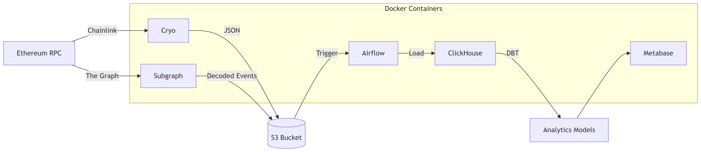
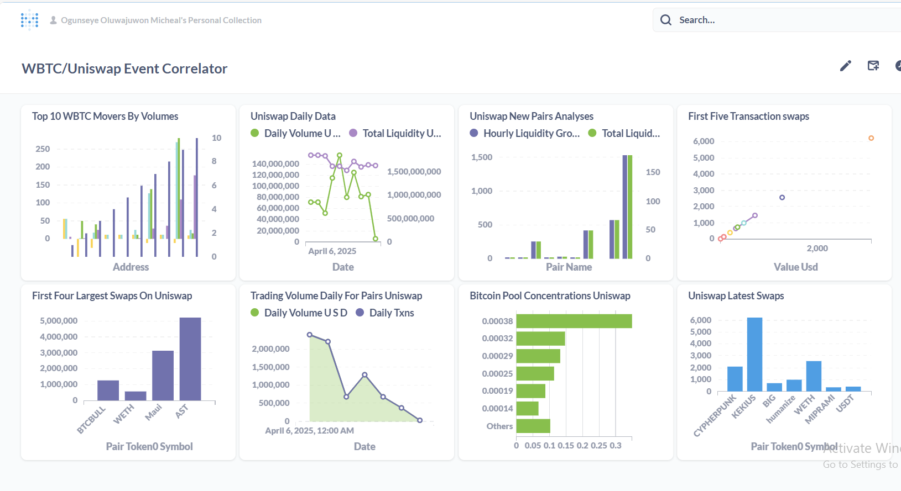
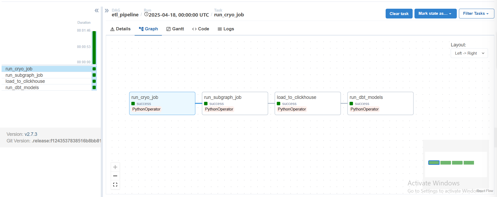

# **🚀 WBTC → S3 → ClickHouse Analytics Pipeline**  
*High-performance blockchain ETL with etherium node, clickhouse, S3, Airflow, DBT, and Metabase*  

### **🔍 Overview**  
Pipeline Overview
This data stack extracts raw Ethereum data (WBTC/Uniswap events) through multiple complementary methods: Chainlink RPC provides direct blockchain access for real-time queries, while Subgraph streams decoded event data, and Cryo handles bulk historical log extraction. The collected data is stored in a dual-layer system - S3 serves as a reliable backup for raw JSON logs, while ClickHouse functions as the primary analytical database optimized for high-throughput blockchain queries.

The transformation layer leverages DBT for SQL-based modeling and custom aggregations tailored for WBTC flow analysis. Airflow orchestrates the entire workflow, managing scheduled pipeline execution and dependencies, while Metabase delivers visualization capabilities and alerting to complete the analytics loop. This architecture balances real-time and historical processing with scalable storage and transformation.  

---

## ⚡ Technology Stack  
### Programming Languages & Core Tools  
| **Category**       | **Technologies**                          |
|--------------------|------------------------------------------|
| **Blockchain**     | Rust (Cryo), Solidity (Subgraph contracts) |
| **Data Processing**| Python (Airflow, DBT), Jinja SQL (Templates) |
| **Database**       | ClickHouse SQL, PL/pgSQL (Metabase)      |
| **Infrastructure** | Docker, YAML, Bash                       |

---
---

## **⚡ Key Components**  
| **Layer**          | **Technology**                     | **Role**                                  |  
|---------------------|------------------------------------|-------------------------------------------|  
| **Ingestion**       | Chainlink RPC, Subgraph, Cryo      | Stream raw Ethereum logs/events           |  
| **Storage**         | S3 (Intermediate), ClickHouse      | Scalable raw data lake + analytics DB     |  
| **Transformation**  | DBT                                | Clean, aggregate, and model data          |  
| **Orchestration**   | Airflow                            | Schedule and monitor pipeline runs         |  
| **Visualization**   | Metabase                           | Interactive dashboards                    |  

---

## **🛠️ Architecture**  

## Architecture 


## Dashboard


## Scheduler



## **🚀 Quick Start**  
### **1. Prerequisites**  
- AWS credentials (for S3)  
- Chainlink RPC endpoint  
- Docker + Docker Compose  

### **2. Configure**  
```bash  
cp .env.example .env  # Set RPC_URL, S3_PATH, CLICKHOUSE_CREDS  
```  

### **3. Start Services**  
```bash  
docker-compose up -d --build  
```  
- **Airflow**: `http://localhost:8081` (DAGs: `eth_to_s3`, `s3_to_clickhouse`)  
- **Metabase**: `http://localhost:3000`  
- **ClickHouse**: Port `8123` (HTTP)  

### **4. Run Transformations**  
```bash  
docker exec -it dbt run-operation run_clickhouse_transforms  
```  

---

## **📊 Data Flow**  
1. **Extract**  
   - `cryo eth_logs --rpc <RPC_URL> --output s3://path/raw_logs.json`  
   - Subgraph listens for Uniswap/WBTC events  

2. **Load**  
   - Airflow DAGs parse JSON → S3 → ClickHouse (`eth_raw.logs`)  

3. **Transform**  
   - DBT models:  
     ```sql  
     -- models/wbtc_flows.sql  
     SELECT  
       from_address,  
       SUM(amount) as total_wbtc  
     FROM {{ ref('raw_ethereum_logs') }}  
     WHERE token = 'WBTC'  
     GROUP BY 1  
     ```  

4. **Visualize**  
   - Metabase connects to ClickHouse → Build dashboards  

---

## **📂 Repository Structure**  
```  
├── dags/                  # Airflow: eth_to_s3.py, s3_to_clickhouse.py  
├── dbt/                   # DBT models (staging, marts)  
│   ├── models/  
│   │   ├── staging/       # Raw schema tables  
│   │   └── marts/         # Analytics-ready models  
├── cryo_scripts/          # Cryo configs for Ethereum extraction  
├── docker/                # Custom images (Airflow + DBT)  
├── .env.example           # RPC, S3, and DB credentials  
└── docker-compose.yml     # Airflow, ClickHouse, Metabase  
```  

---

## **⚙️ Advanced Setup**  
### **Scaling Ingestion**  
---

### **Scaling Ingestion**  
For efficient WBTC data collection, use dynamic block ranges with safety buffers:  

```python
# In your Airflow DAG or Python script
try:
    current_block = web3.eth.block_number
    latest_safe_block = current_block - 7200  # 24h buffer
    block_range = f"{latest_safe_block - 300}:{latest_safe_block}"  # 300-block window
    
    cryo.collect(
        "erc20_transfers",
        blocks=[block_range],
        contract=["0x2260FAC5E5542a773Aa44fBCfeDf7C193bc2C599"],  # WBTC
        rpc=ETH_RPC_URL,
        output_format="parquet",
        requests_per_second=25
    )
    
except Exception as e:
    logger.error(f"Block range processing failed: {e}")
    raise
```

#### **Key Improvements Over Static Ranges**  
1. **Chain-Aware**:  
   - Dynamically detects chain head  
   - 24h buffer prevents reorg issues  

2. **Optimized Performance**:  
   - Smaller 300-block windows reduce RPC load  
   - Parquet format for efficient storage  

3. **Production-Ready**:  
   - Built-in error handling  
   - Configurable safety margins  

#### **To Parallelize** (if needed):  
```python
from concurrent.futures import ThreadPoolExecutor

block_ranges = [
    f"{start}:{start+300}" 
    for start in range(latest_safe_block-5000, latest_safe_block, 300)
]

with ThreadPoolExecutor(max_workers=4) as executor:
    executor.map(lambda r: cryo.collect(blocks=[r], ...), block_ranges)
```

---

## **📜 License**  
MIT License. *Not affiliated with Chainlink or Ethereum Foundation.*  

---

**💡 Need Help?**  
- For RPC issues: Check Chainlink node logs  
- For DBT errors: `docker logs dbt`  
- For Airflow: `docker-compose logs -f airflow-webserver`  

--- 